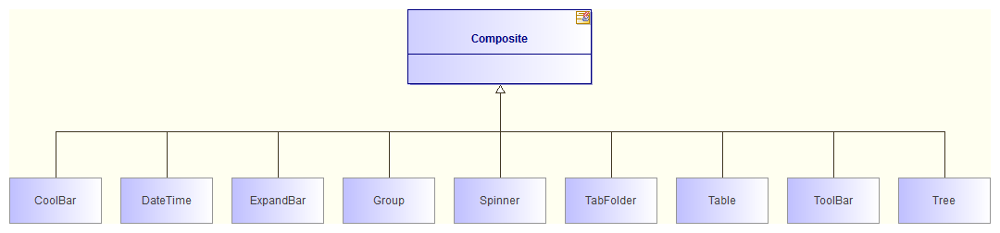

[[Inheritance-diagrams]]

[[inheritance-diagrams]]
Inheritance diagrams
--------------------

The aim of this automatic diagram is to show where a class is situated within its inheritance graph.

[[Contents]]

[[contents]]
Contents
~~~~~~~~

* Class C itself.
* C’s parent classes and interfaces.
* The classes derived from C.
* The implementation and inheritance links.

[[Applicable-elements]]

[[applicable-elements]]
Applicable elements
~~~~~~~~~~~~~~~~~~~

Inheritance diagrams can be created on any Classifier.

[[Layout]]

[[layout]]
Layout
~~~~~~

* Class C is placed in the center of the diagram.
* C’s parent classes and interface:
** are placed above C.
** are viewed in “simple” mode.
** are exactly the same size and are horizontally aligned.
* C’s child classes and interface:
** are placed below C.
** are viewed in “simple” mode.
** are exactly the same size and are horizontally aligned.

*_Note:_* All elements present in this diagram have a specific associated link:Auto_Diagrams_Styles.html[style].

[[Example]]

[[example]]
Example
~~~~~~~

