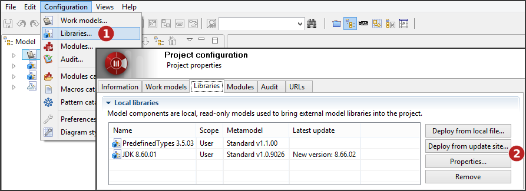
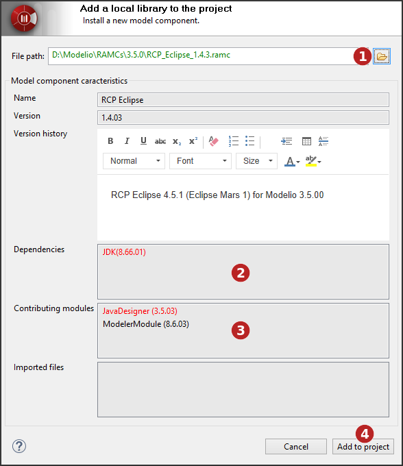
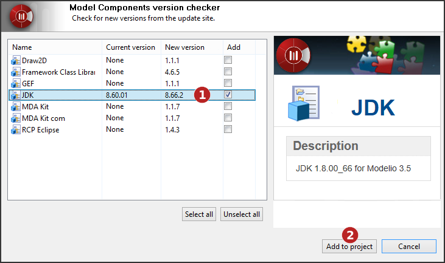

[[Deploying-model-components]]

[[deploying-model-components]]
Deploying model components
--------------------------

[[Introduction]]

[[introduction]]
Introduction
++++++++++++

The deployment of a model component introduces us into the realm of model component usage, and is the first user-oriented phase of the model component

life cycle (as opposed to the developer-oriented model component link:Model_components_development.html[development and packaging] phase).

Model components are deployed by users wishing to use them in their own projects. When a model component has been deployed in a project, it and the model elements it contains appear in the “Model” view in blue, and are in read- only mode.

If a model component depends on another model component, the other model component must be deployed first.

Model component deployment includes the following operations:

* the selection of the model component to be deployed in your project
* the resolution of any deployment issues detected

Library management is carried out in the *Libraries* tab of the *Project configurator* dialog.

[[Configuring-project-libraries]]

[[configuring-project-libraries]]
Configuring project libraries

1.  Click on “Configuration\Libraries…” or on the [image:images/Model_components_deployment/config.png[3]] icon then select the ‘Libraries’ tab.
2.  You can add local libraries to your project, from a local file or from the update site, consult or remove existing ones.

[[From-a-local-file]]

[[from-a-local-file]]
From a local file
+++++++++++++++++

[[Deploying-a-model-component-from-a-local-file]]

[[deploying-a-model-component-from-a-local-file]]
Deploying a model component from a local file

1.  Select the model component (*.ramc file) you wish to add to your project.
2.  Not all mandatory modules have been installed in the project in which you want to deploy the model component. If the model component you want to deploy includes note and tagged value types specific to a given module, then this module must be installed in your project before you deploy the model component. Missing modules are red. To solve this problem, simply run the “Configuration/Modules” command, and install the module you need.
3.  A [dependency][9] that exists between the model component you want to deploy and another model component which must be deployed first in a project has not been respected. Missing model components are red. To solve this problem, simply first deploy the other model component (indicated in the “Dependencies” field) in your project, in the exact version stated, and then run the deployment operation for the model component you want to deploy again.
4.  Click on ‘Add to project’.

[[From-the-update-site]]

[[from-the-update-site]]
From the update site
++++++++++++++++++++

[[Deploying-model-components-from-the-update-site]]

[[deploying-model-components-from-the-update-site]]
Deploying model components from the update site

1.  Select the model component(s) you wish to add or update in your project.
2.  Click on ‘Add to project’.

_*Note:*_ The update site address is defined by the ‘Update site’ option of the ‘Updates’ group in the Modelio preferences (“Configuration / Preferences” menu)

