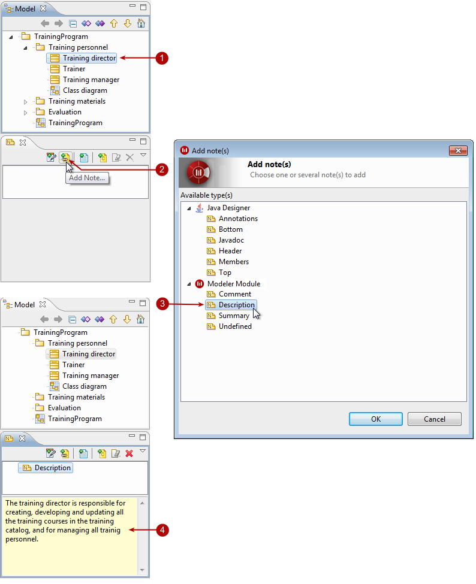
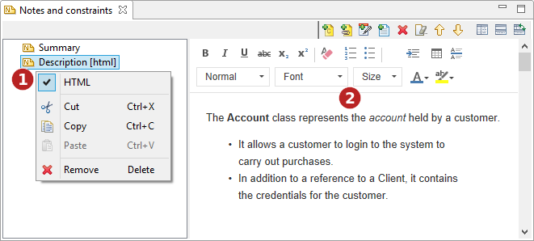

[[Adding-notesconstraints-to-elements]]

[[adding-notesconstraints-to-elements]]
Adding notes/constraints to elements
------------------------------------

There are two ways to add notes or constraints to elements:

* Using the “Create a note” or “Create a constraint” button in the diagram palette.
* Using the link:Modeler-_modeler_interface_properties_view.html[Properties] or link:Modeler-_modeler_interface_annot_view.html[Notes & constraints] view on the concerned element.

[[Adding-a-note-to-a-class-in-the-ldquoNotes-amp-constraintsrdquo-view]]

[[adding-a-note-to-a-class-in-the-notes-constraints-view]]
Adding a note to a class in the “Notes & constraints” view

Steps:

1.  Select the element you want to add a note to.
2.  In the “Notes & constraints” view, click on the “Add a note” icon.
3.  In the “Add note(s)” window, select the type of note(s) you want to add and click OK.
4.  The new note then appears, and you can enter its contents in the dedicated zone.

[[HTML-editor-for-Description-notes]]

[[html-editor-for-description-notes]]
HTML editor for Description notes
~~~~~~~~~~~~~~~~~~~~~~~~~~~~~~~~~

[[Description-Notes-can-be-edited-in-HTML]]

[[description-notes-can-be-edited-in-html]]
Description Notes can be edited in HTML

Steps:

1.  Select the MIME type of the note.
2.  Use the HTML editor.

