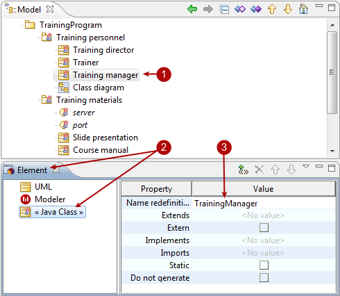

[[Adding-tagged-values-to-elements]]

[[adding-tagged-values-to-elements]]
Adding tagged values to elements
--------------------------------

[[Introduction]]

[[introduction]]
Introduction
++++++++++++

Tagged values are added in the link:Modeler-_modeler_interface_properties_view.html[Properties] or link:Modeler-_modeler_interface_uml_prop_view.html[Element] view to elements selected in the “Model” view.

The “Element” view contains a tagged value display table, which presents all the tagged values available for addition to the selected element. Available tagged values are presented by module.

There are three kinds of tagged value:

* Tagged values which have no parameters
* Tagged values which have one parameter
* Tagged values which can have several parameters

[[Adding-a-tagged-value-which-has-no-parameters]]

[[adding-a-tagged-value-which-has-no-parameters]]
Adding a tagged value which has no parameters
+++++++++++++++++++++++++++++++++++++++++++++

image:images/Modeler-_modeler_building_models_add_tv/modifelements_004.png[2]

[[Adding-a-tagged-value-which-has-no-parameters-to-a-package]]

[[adding-a-tagged-value-which-has-no-parameters-to-a-package]]
Adding a tagged value which has no parameters to a package

Steps:

1.  Select the element you want to add a tagged value to.
2.  Open the “Element” view and then the appropriate group.
3.  Tagged values which have no parameters are added or removed simply by checking or unchecking their associated tickbox.

[[Adding-a-tagged-value-which-takes-one-parameter]]

[[adding-a-tagged-value-which-takes-one-parameter]]
Adding a tagged value which takes one parameter
+++++++++++++++++++++++++++++++++++++++++++++++

[[Adding-a-tagged-value-which-has-one-parameter-to-a-class]]

[[adding-a-tagged-value-which-has-one-parameter-to-a-class]]
Adding a tagged value which has one parameter to a class

Steps:

1.  Select the element you want to add a tagged value to.
2.  Open the “Element” view and then the appropriate group.
3.  Tagged values which have one parameter are added to the selected element when you enter a value for the parameter. Click on the “Value column” field for the tagged value you want to add and enter a value for the parameter. Confirm by pressing Enter.

[[Adding-a-tagged-value-which-can-take-several-parameters]]

[[adding-a-tagged-value-which-can-take-several-parameters]]
Adding a tagged value which can take several parameters
+++++++++++++++++++++++++++++++++++++++++++++++++++++++

image:images/Modeler-_modeler_building_models_add_tv/modifelements_006.png[image]

[[Adding-a-tagged-value-which-has-several-parameters-to-a-class]]

[[adding-a-tagged-value-which-has-several-parameters-to-a-class]]
Adding a tagged value which has several parameters to a class

Steps:

1.  Select the element you want to add a tagged value to.
2.  Open the “Element” view and then the appropriate group.
3.  Tagged values which have several parameters are added to the selected element when you enter the values for the different parameters Click in the “Value column” field for the tagged value you want to add. The “Edit tagged value parameters” window then appears.
4.  Enter the different parameter values (with their complete namespace) and click on  to validate each entry. To finish, click on OK.

