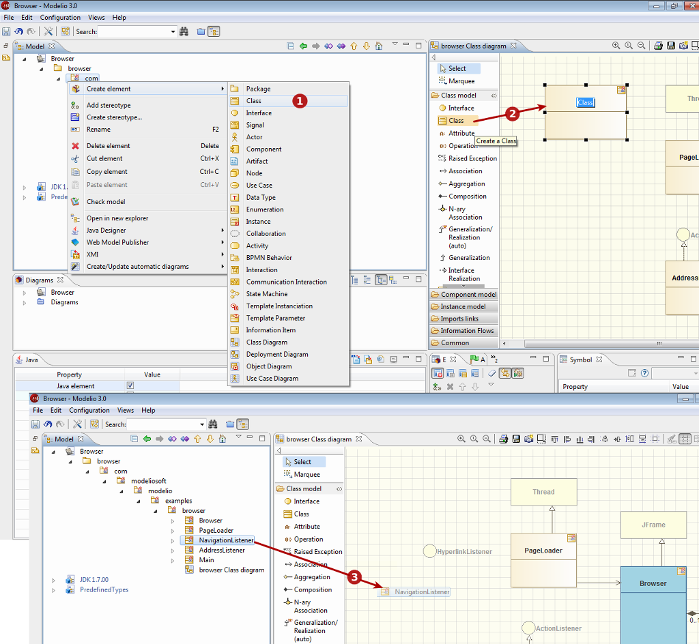

[[Creating-elements]]

[[creating-elements]]
Creating elements
-----------------

[[Three-ways-of-creating-elements]]

[[three-ways-of-creating-elements]]
Three ways of creating elements
+++++++++++++++++++++++++++++++

[[The-three-ways-of-creating-an-element-in-Modelio]]

[[the-three-ways-of-creating-an-element-in-modelio]]
The three ways of creating an element in Modelio

*Key:*

* *1*. Using the popup menu (Right-click on the element you want to create a new element in, then choose the kind of element you want to create)
* *2*. Using the diagram palette (click on the creation icon corresponding to the kind of element you want to create, then click in the diagram background to locate and create the new element)
* *3*. By unmasking it to a diagram (drag&drop an element from the Model browser to the diagram background)

