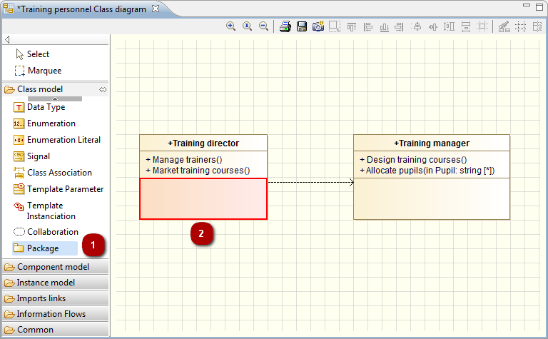
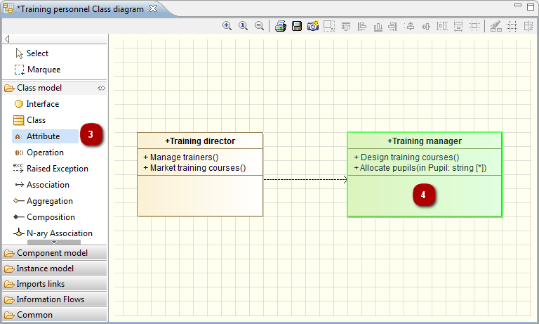

[[Creating-node-type-elements-in-diagrams]]

[[creating-node-type-elements-in-diagrams]]
Creating node-type elements in diagrams
---------------------------------------

In Modelio diagrams, elements are created using the icons in the palette on the left of the diagram.

All Modelio diagrams include the model expert feature, which provides real-time assistance when you are creating elements in diagrams.

Examples:

[[Creating-a-package-in-a-class-in-a-class-diagram-ndash-forbidden]]

[[creating-a-package-in-a-class-in-a-class-diagram-forbidden]]
Creating a package in a class in a class diagram – forbidden

If you try to create an unauthorized element (in this example, if you try to create a package *(1)* inside a class), the model expert highlights the concerned element in red *(2)*, indicating that the creation operation you are attempting is not allowed.

[[Creating-an-attribute-in-a-class-in-a-class-diagram-ndash-allowed]]

[[creating-an-attribute-in-a-class-in-a-class-diagram-allowed]]
Creating an attribute in a class in a class diagram – allowed

If you try to create an authorized element (in this example, if you try to create an attribute *(3)* inside a class), the model expert highlights the concerned element in green *(4)*, indicating that the creation operation you are attempting is allowed.

