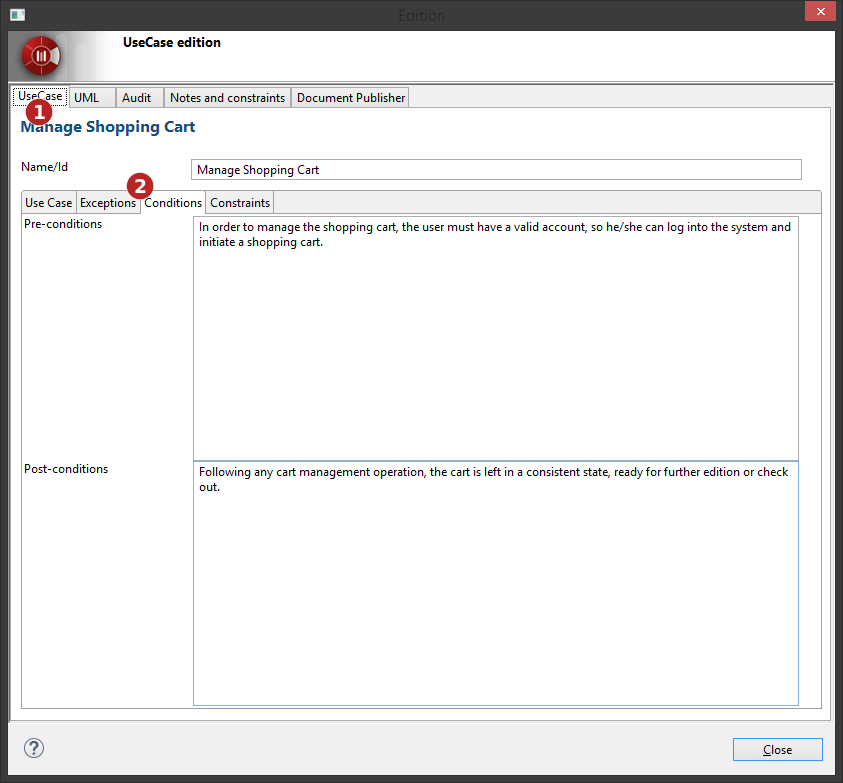

[[Editing-elements-using-edition-boxes]]

[[editing-elements-using-edition-boxes]]
Editing elements using edition boxes
------------------------------------

Elements can be edited through an edition box by double-cliking on them, or by using the ‘image:images/Modeler-_modeler_building_models_editing_elements/openproperties.png[1] Edit element…’ contextual menu command.

image:images/Modeler-_modeler_building_models_editing_elements/EditElement_en.png[2]

[[Generic-edition-box]]

[[generic-edition-box]]
Generic edition box

*Key:*

1.  Properties tab, similar to the link:Modeler-_modeler_building_models_modifying_element_props.html[Element view].
2.  Audit tab, similar to the link:Modeler-_modeler_handy_tools_model_audit.html[Check model window].
3.  Notes and constraints tab, similar to the link:Modeler-_modeler_building_models_add_notes.html[Notes and constraints view].
4.  Modules tabs for each relevant module.
5.  Quick “Description” note edition frame.

[[Noteworthy-edition-boxes]]

[[noteworthy-edition-boxes]]
Noteworthy edition boxes
~~~~~~~~~~~~~~~~~~~~~~~~

Some edition boxes are designed specifically for some elements:

[[Operations]]

[[operations]]
Operations
++++++++++

image:images/Modeler-_modeler_building_models_editing_elements/EditOperation_en.png[6]

[[Operation-edition-box]]

[[operation-edition-box]]
Operation edition box

*Key:*

1.  Operation dedicated tab.
2.  Parameters management frame.

[[Use-Case]]

[[use-case]]
Use Case
++++++++

[[Use-Case-edition-box]]

[[use-case-edition-box]]
Use Case edition box

*Key:*

1.  Use Case dedicated tab.
2.  Use Case specific notes tabs.

