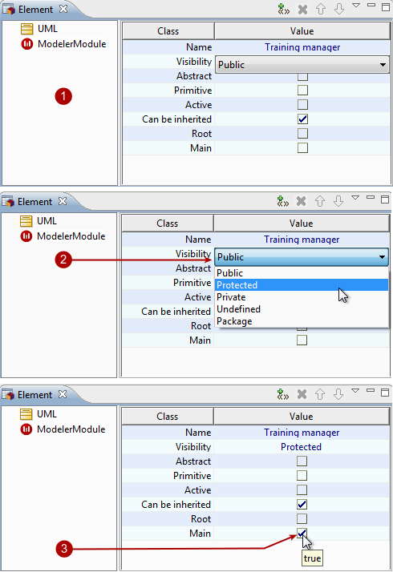

[[Modifying-an-elementrsquos-properties]]

[[modifying-an-elements-properties]]
Modifying an element’s properties
---------------------------------

An element’s properties can be modified in the link:Modeler-_modeler_interface_properties_view.html[Properties] or link:Modeler-_modeler_interface_uml_prop_view.html[Element] view.

[[Changing-a-class-properties]]

[[changing-a-class-properties]]
Changing a class' properties

Key:

1.  These are the original properties of the “Training manager” class.
2.  Let’s start by changing its visibility – click on the field to activate it, click on the arrow on the right of the field to open the drop-down list and select the visibility of your choice.
3.  Now let’s indicate that the class is a main class by clicking inside the tickbox. A tick appears indicating that the class is now main.

