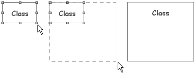

[[Changing-an-elementrsquos-size-in-a-diagram]]

[[changing-an-elements-size-in-a-diagram]]
Changing an element’s size in a diagram
---------------------------------------

[[Re-sizing-an-element]]

[[re-sizing-an-element]]
Re-sizing an element
++++++++++++++++++++

To change the size of an element in a diagram, simply select one of the control points surrounding the element and drag it to the required size.

[[Re-sizing-a-class]]

[[re-sizing-a-class]]
Re-sizing a class

[[The-ldquoFit-to-contentrdquo-command]]

[[the-fit-to-content-command]]
The “Fit to content” command
++++++++++++++++++++++++++++

The  *‘Fit to content’* command in the diagram edition view toolbar and in the *‘Layout’* contextual menu on a diagram element is used to adjust the size of the selected element to the size of its properties: name, attributes, operations, elements contained inside it, and so on.

