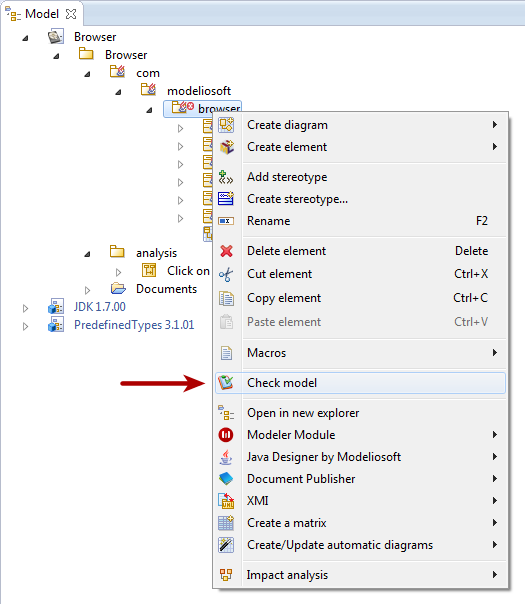

[[Modelio-model-audit]]

[[modelio-model-audit]]
Modelio model audit
-------------------

[[Real-time-model-audit]]

[[real-time-model-audit]]
Real time model audit
+++++++++++++++++++++

The Modelio Audit feature analyses the model in real time. When errors are detected, it adds a flag on each of the corresponding elements in the model browser:

image:images/Modeler-_modeler_handy_tools_model_audit/img_001.png[2]

[[In-the-above-example-the-Audit-has-detected-an-error-in-the-ldquobrowserrdquo-package]]

[[in-the-above-example-the-audit-has-detected-an-error-in-the-browser-package]]
In the above example, the Audit has detected an error in the “browser” package

[[The-Modelio-Check-model-command]]

[[the-modelio-check-model-command]]
The Modelio Check model command
+++++++++++++++++++++++++++++++

When the Audit feature points out errors or warnings in your model, you have to possibility to get the corresponding error messages in one click by running the “Check model” command:

[[Running-the-ldquoCheck-modelrdquo-command]]

[[running-the-check-model-command]]
Running the “Check model” command

The Check model command will re-check the model and provide an accurate and up-to-date report:

image:images/Modeler-_modeler_handy_tools_model_audit/img_003.png[4]

[[The-Model-Audit-result-window]]

[[the-model-audit-result-window]]
The Model Audit result window

By double-clicking on one of the errors in the report, you will get a detailed description of the error and tips on how to fix it.

[[The-problem-details-window]]

[[the-problem-details-window]]
The problem details window

*Note*: if you click on the elements listed in the problem details window, Modelio will select them in the model browser, making it even easier for you to fix the problem where it lies.

