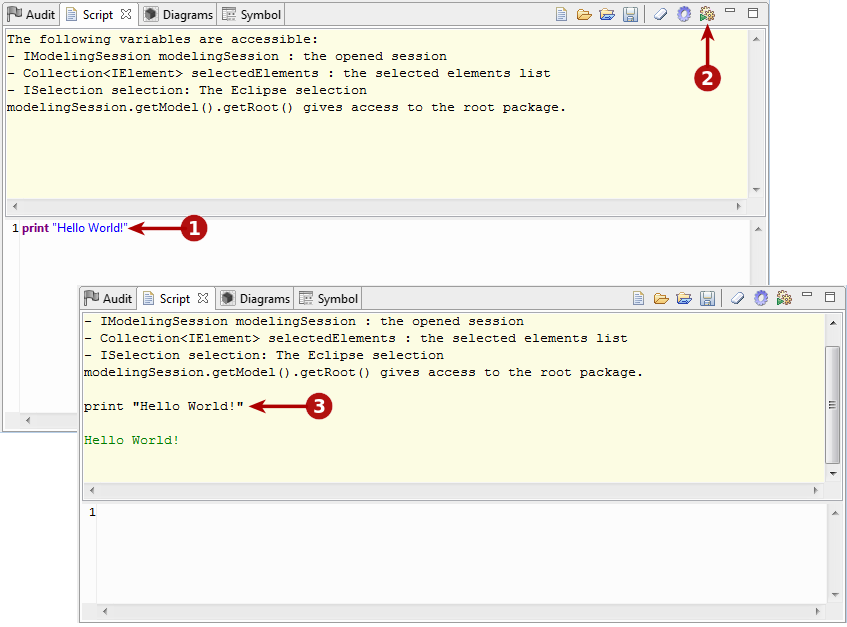
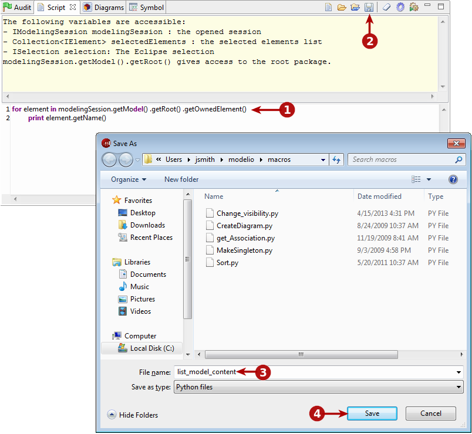

[[Scripts]]

[[scripts]]
Scripts
-------

[[Introduction]]

[[introduction]]
Introduction
++++++++++++

With Modelio, you can run scripts written in Jython:

* either from the Modelio command line
* or in a dedicated view called the Script view

You can also save these scripts as macros, which you can then use as often as you wish. These macros are defined and organized in a dedicated catalog, and can be run through an associated pop-up menu command, an associated toolbar icon or through the macro window itself. For more information on macros, please see the section on the link:Modeler-_modeler_modelio_settings_macros_catalog.html[macros catalog].

[[The-script-view]]

[[the-script-view]]
The script view
+++++++++++++++

image:images/Modeler-_modeler_handy_tools_scripts_macros/scripts1.png[2]

[[The-script-view-2]]

[[the-script-view-1]]
The script view

*Key:*

* *1*. To open the Script view, run the “Views/Script” command.
* *2*. The Script view tab.
* *3*. The Script view toolbar (see below).
* *4*. The Script view output zone.
* *5*. The Script view intput zone.

[[The-script-view-toolbar]]

[[the-script-view-toolbar]]
The script view toolbar
+++++++++++++++++++++++

The script view toolbar buttons run the following operations:

* image:images/Modeler-_modeler_handy_tools_scripts_macros/macro_catalog.png[10]: Opens the macro catalog, where scripts which have been saved as macros are presented.
* image:images/Modeler-_modeler_handy_tools_scripts_macros/load_script.png[11]: Loads an existing script.
* : Loads an existing script and automatically runs it.
* image:images/Modeler-_modeler_handy_tools_scripts_macros/save_script.png[13]: Saves the script entered in the script input zone in a file.
* image:images/Modeler-_modeler_handy_tools_scripts_macros/clear_content.png[14]: Clears the entire contents of the script view output zone.
* : Activates the script debug mode. In this mode, the script input zone is not cleared when a script is run.
* image:images/Modeler-_modeler_handy_tools_scripts_macros/run_in_input.png[16]: Runs the script entered in the script input zone and displays the result in the script display zone. Clears the input view except if the debug mode is active.

*Note:* Two keyboard shortcuts exist for the script view:

* *Ctrl+Enter*: Runs everything in the script input zone.
* *Shift+Enter*: Runs only what is selected in the script input zone.

[[Entering-and-running-Jython-scripts]]

[[entering-and-running-jython-scripts]]
Entering and running Jython scripts
+++++++++++++++++++++++++++++++++++

[[Entering-and-running-a-Jython-script]]

[[entering-and-running-a-jython-script]]
Entering and running a Jython script

*Key:*

* *1*. Write your script in the Script view input zone.
* *2*. Click on the image:images/Modeler-_modeler_handy_tools_scripts_macros/go_16.png[7] button to execute the script.
* *3*. The result immediately appears in the Script view output zone.

[[Saving-a-script-for-re-use]]

[[saving-a-script-for-re-use]]
Saving a script for re-use
++++++++++++++++++++++++++

If you intend to re-use a Jython script, you may want to save it, as shown below.

[[Saving-a-Jython-script]]

[[saving-a-jython-script]]
Saving a Jython script

*Key:*

* *1*. Write your script in the Script view input zone.
* *2*. Click on the image:images/Modeler-_modeler_handy_tools_scripts_macros/save_16.png[8] button to save the script in a file.
* *3*. Choose a name and location for the script.
* *4*. Click on Save.

*Note:* Scripts which have been saved can be used as macros, available at either project, workspace or application level. For more information, please see the section on the link:Modeler-_modeler_modelio_settings_macros_catalog.html[macros catalog].

