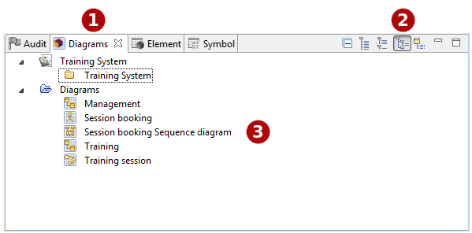

[[The-Diagrams-view]]

[[the-diagrams-view]]
The Diagrams view
-----------------

[[The-Diagrams-explorer-view-in-User-Folder-mode]]

[[the-diagrams-explorer-view-in-user-folder-mode]]
The Diagrams explorer view in User Folder mode

*Key:*

* *1*. The “Diagrams” tab.
* *2*. The “Diagrams” view toolbar.
* *3*. Diagrams

[[Main-diagram-explorer-commands]]

[[main-diagram-explorer-commands]]
Main diagram explorer commands
++++++++++++++++++++++++++++++

*From the Diagrams explorer contextual menu:*

* *Create a folder* [image:images/Modeler-_modeler_interface_diagrams_view/closed_set_16.png[4] – Create a folder] : Creates a user folder under the selected element.
* *Delete an element* [image:images/Modeler-_modeler_interface_diagrams_view/delete.png[5] – Delete / *Del* key] : Delete the selected element.
* *Rename an element* [ – Rename / *F2* key] : Rename the selected element.

*From the Diagrams explorer toolbar:*

* *Collapse all* [image:images/Modeler-_modeler_interface_diagrams_view/collapse_all.gif[7]] : Collapses all elements and shows only the root project.
* *Flat view* [] : Display the diagrams in flat view.
* *List diagrams by type* [] : Display the diagrams in folders according to their type.
* *List diagrams by user folders* [image:images/Modeler-_modeler_interface_diagrams_view/user_browser16.png[10]] : Display shortcuts to the diagrams in folders created by the user.
* *List diagram by owner* [] : Display the diagrams under their owner.

*Note:* For more information, see “link:Modeler-_modeler_diagrams_creating_diagram.html[Creating a diagram]” and “link:Modeler-_modeler_diagrams_opening_diagram.html[Opening a diagram]”.

