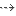

[[The-Links-Editor-view]]

[[the-links-editor-view]]
The Links Editor view
---------------------

[[The-Links-Editor-view-2]]

[[the-links-editor-view-1]]
The Links Editor view

[[Main-Links-Editor-view-commands]]

[[main-links-editor-view-commands]]
Main Links Editor view commands
+++++++++++++++++++++++++++++++

*From the Links Editor toolbar:*

* *Pin/Unpin selected element* [] : Switches the Links Editor from Visualize to Edit mode.
* *Copy as a graphic* [image:images/Modeler-_modeler_interface_linkeditor_view/copy_image.png[8]] : Copies the content of the Links Editor to the clipboard.
* *Save in a file* [image:images/Modeler-_modeler_interface_linkeditor_view/save_image.png[9]] : Opens the “Save as” window, in which you can configure the saving of Links Editor content in a file.
* *Print* [image:images/Modeler-_modeler_interface_linkeditor_view/print.png[10]] : Prints the content of the Links Editor.
* *Zoom out* [image:images/Modeler-_modeler_interface_linkeditor_view/zoom_out.png[11]] : Zooms out.
* *Zoom to 1:1* [image:images/Modeler-_modeler_interface_linkeditor_view/zoom_to_default.png[12]] : Switches to 1:1 scale.
* *Zoom in* [image:images/Modeler-_modeler_interface_linkeditor_view/zoom_in.png[13]] : Zooms in.

*From the Links Editor view menu:*

* *Horizontal layout* [image:images/Modeler-_modeler_interface_linkeditor_view/Horizontal_Orientation.png[15]] : Displays links and elements horizontally.
* *Vertical layout* [] : Displays links and elements vertically.
* *Automatic layout orientation* [] : Displays links and elements depending on the type of links to display.

*From the Links Editor bottom bar:*

* *Show/Create Inheritance* [image:images/Modeler-_modeler_interface_linkeditor_view/generalization.png[18]] : When checked, displays Inheritance links, and creates them when elements are dropped into the Links Editor, if it is in Edit mode.
* *Show/Create Associations* [] : When checked, displays Associations links, and creates them when elements are dropped into the Links Editor, if it is in Edit mode.
* *Show/Create Element Imports* [] : When checked, displays Element Imports links, and creates them when elements are dropped into the Links Editor, if it is in Edit mode.
* *Show/Create Traceability* [image:images/Modeler-_modeler_interface_linkeditor_view/traceability.png[24]] : When checked, displays Traceability links, and creates them when elements are dropped into the Links Editor, if it is in Edit mode.
* *Show/Create Dependencies* [image:images/Modeler-_modeler_interface_linkeditor_view/dependency.png[21]] : When checked, displays Dependencies links, and creates them when elements are dropped into the Links Editor, if it is in Edit mode.
* *Filter Dependencies* [image:images/Modeler-_modeler_interface_linkeditor_view/Filter.png[22]] : When checked, dependencies are displayed/created according to the Dependencies filter.
* *Set Dependencies filter* [] : Enables the Dependencies filter to be configured, selecting which stereotyped dependencies will be displayed/created.
* *Show NamespaceUses* [image:images/Modeler-_modeler_interface_linkeditor_view/namespaceuse.png[25]] : When checked, displays NamespaceUses links.
* *Downstream levels displayed* : Defines the number of linked elements that will be displayed downstream from the selected element.
* *Upstream levels displayed* : Defines the number of linked elements that will be displayed upstream from the selected element.

*Note:* For more information, see “link:Modeler-_modeler_building_models_creating_links_linkeditor.html[Creating links using the Links Editor]”.

