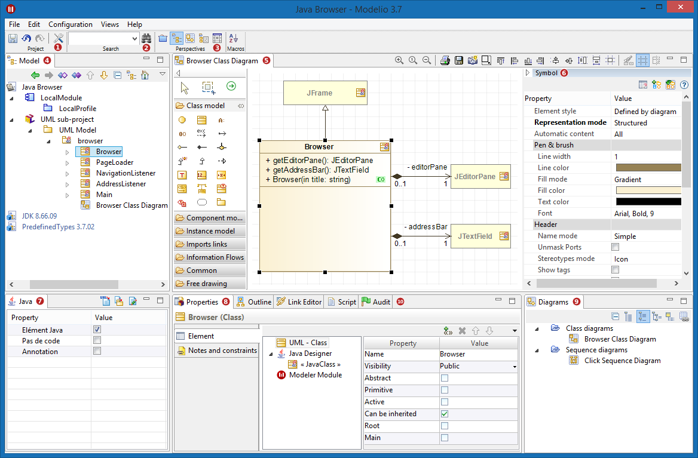

[[The-main-window]]

[[the-main-window]]
The main window
---------------

[[The-Modelio-main-window]]

[[the-modelio-main-window]]
The Modelio main window

*Key:*

* *1*. The link:Modeler-_modeler_managing_projects_configuring_project_informations.html[Project configurator]. This tool lets you configure your project’s information, work models, libraries, modules, audit and URLs.
* *2*. The link:Modeler-_modeler_handy_tools_advanced_search.html[Advanced search tool]. This tool searches for NameSpace elements based on a partial or complete name.
* *3*. The Perspectives buttons. This tool lets you switch between perspectives.
* *4*. The link:Modeler-_modeler_interface_uml_view.html[Model view]. This is where you can view, browse and edit your UML/BPMN model.
* *5*. The link:Modeler-_modeler_interface_edition_view.html[Diagram Edition view]. This view is where you can view and edit your model in diagram form.
* *6*. The link:Modeler-_modeler_diagrams_graphic_options.html[Symbol view]. This is where you can view and edit the graphic properties of your diagrams.
* *7*. The modules tab. This view is where you can view and edit the options bought by link:Modeler-_modeler_managing_projects_configuring_project_modules.html[modules] (in this example Java Designer).
* *8*. The link:Modeler-_modeler_building_models_modifying_element_props.html[Properties view]. This is where you can add or remove stereotypes or tagged values and view and edit the UML properties of an element selected in the navigation or edition views.
* *9*. The link:Modeler-_modeler_interface_diagrams_view.html[Diagrams view]. This is where you can view, browse and sort your diagrams.
* *10*. Other views. link:Modeler-_modeler_handy_tools_scripts_macros.html[Script], link:Modeler-_modeler_building_models_creating_links_linkeditor.html[Link Editor], link:Modeler-_modeler_interface_audit_view.html[Audit], link:Modeler-_modeler_interface_outline_view.html[Outline]…

*Note:* All the views in the Modelio main window are dockable and can be positioned anywhere within the Modelio main window. Use the ‘Views’ menu of the Modelio menu bar to select the views you want to display.

