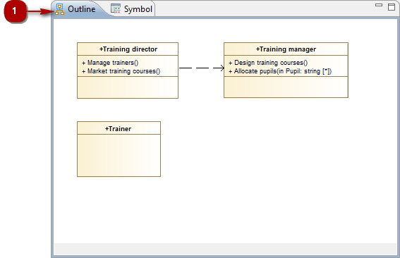

[[The-Outline-view]]

[[the-outline-view]]
The Outline view
----------------

[[The-Outline-view-2]]

[[the-outline-view-1]]
The Outline view

*Key:*

* *1*. The “Outline” tab.

The “Outline” view provides a miniature view of your diagram, thereby providing you with an overview of your entire diagram.

The “Outline” view also enables you to see which elements are currently visible in the “Diagram edition” view, and which are not (because they are situated outside the zone currently shown in the “Diagram edition” view). The part of the diagram which is visible in the “Diagram edition” view is shown inside a frame with a gray background, while those parts which are hidden are shown inside a frame with a white background.

