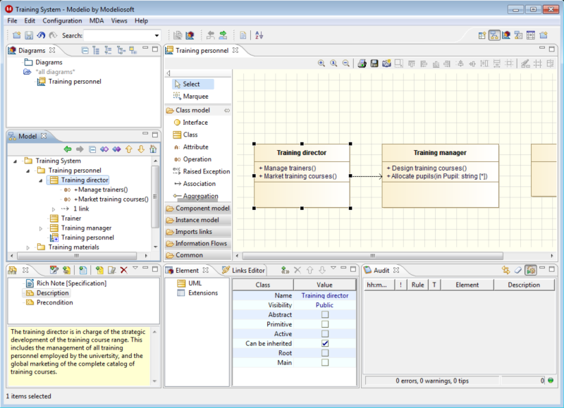
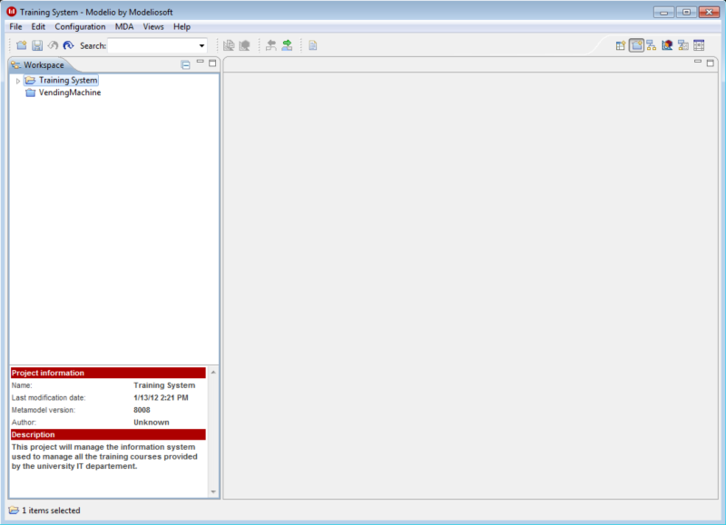

[[Perspectives]]

[[perspectives]]
Perspectives
------------

[[What-are-Perspectives]]

[[what-are-perspectives]]
What are Perspectives?
^^^^^^^^^^^^^^^^^^^^^^

A perspective defines the set and layout of views dipslayed in Modelio, providing an additional layer of organization when interacting with a model. Users can switch between perspectives as they move through tasks. In Modelio, several perspectives are available, each one tailored to suit a particular set of tasks.

*Note:* It is still possible to manually open or close views, as well as resize and move them.

[[Switching-Perspectives]]

[[switching-perspectives]]
Switching Perspectives

[[Full-Perspective]]

[[full-perspective]]
Full Perspective
^^^^^^^^^^^^^^^^

This perspective displays most views, providing a quick view of all available functionalities.

[[Model-Perspective]]

[[model-perspective]]
Model Perspective
^^^^^^^^^^^^^^^^^

The model perspective is intended for pure detailed modeling. Element properties and annotations are quickly accessible, as well as the audit view, which will help you build a better model. In this perspective, diagrams are a way to create and view model elements, but they are not the main target.

[[Diagram-Perspective]]

[[diagram-perspective]]
Diagram Perspective
^^^^^^^^^^^^^^^^^^^

image:images/Modeler-_modeler_interface_perspectives/PerspectiveDiagram.png[5]

This perspective focuses on the diagram edition zone, in order to facilitate diagram creation and edition. Use the diagram or model browsers to find the diagrams you want, and then switch to the outline view to quickly see their content. The symbol view also plays a big part in this perspective, mainly to edit graphical properties of your diagram elements.

[[Trace-Perspective]]

[[trace-perspective]]
Trace Perspective
^^^^^^^^^^^^^^^^^

This perspective concentrates on quick link walkthrough. Are you wondering what the inheritence tree of an element is, or which use cases are traced? If so, then this is the perspective you need!

[[Development-Perspective]]

[[development-perspective]]
Development Perspective
^^^^^^^^^^^^^^^^^^^^^^^

The development perspective focuses on working with modules, such as code generators. Editors take up a large part of the application, as well as element and module-specific properties.

[[Workspace-Perspective]]

[[workspace-perspective]]
Workspace Perspective
^^^^^^^^^^^^^^^^^^^^^

The Workspace perspective shows all the projects in your current workspace. In this perspective, you can create, delete, import, export and rename your projects. You can also see if a project is locked (and who is locking it), whether its model needs to be migrated before using it, and so on.

This perspective is used by default when no project is open (i.e. upon opening Modelio, after closing a project, and so on) and is automatically replaced when a project is opened.

