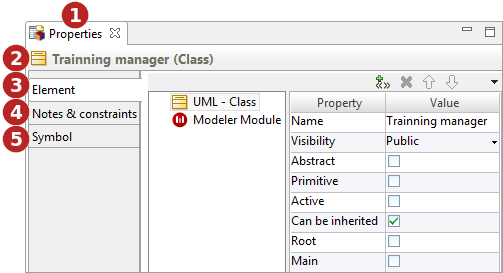

[[The-Properties-view]]

[[the-properties-view]]
The Properties view
-------------------

The *Properties* view is a combined view aggregating the *link:Modeler-_modeler_interface_uml_prop_view.html[Element]*, *link:Modeler-_modeler_interface_annot_view.html[Notes & constraints]* and *link:Modeler-_modeler_interface_symbol_view.html[Symbol]* views.

[[The-Properties-view-2]]

[[the-properties-view-1]]
The Properties view

*Key:*

* *1*. *“Properties”* view tab.
* *2*. Selected element’s name and metaclass.
* *3*. “link:Modeler-_modeler_interface_uml_prop_view.html[Element]” tab.
* *4*. “link:Modeler-_modeler_interface_annot_view.html[Notes & constraints]” tab.
* *5*. “link:Modeler-_modeler_interface_symbol_view.html[Symbol]” tab.

