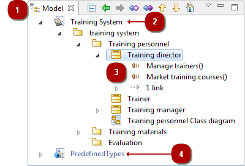
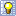
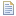
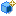
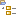

[[The-Model-view]]

[[the-model-view]]
The Model view
--------------

[[The-Model-view-2]]

[[the-model-view-1]]
The Model view

*Key :*

* *1*. Model explorer tab.
* *2*. Local work model.
* *3*. Model elements.
* *4*. Deployed model component (local library)

[[Main-Model-explorer-commands]]

[[main-model-explorer-commands]]
Main Model explorer commands
++++++++++++++++++++++++++++

*From the explorer contextual menu:*

* *Create a diagram or a matrix* [ – Create a diagram or matrix…] : Launch a creation wizard to create a diagram or a matrix of your choice (see link:Modeler-_modeler_diagrams_creating_diagram.html[Creating a diagram] for more details)…
* *Create an element* [ – Create element] : Creates the element of your choice under the selected element.
* *Add stereotype(s) on an element* [image:images/Modeler-_modeler_interface_uml_view/addStereotype_16.png[15] – Add stereotype(s)…] : Adds one or several stereotypes to the selected element.
* *Create a stereotype* [image:images/Modeler-_modeler_interface_uml_view/createstereotype.png[14] – Create stereotype…] : Creates a new stereotype (see link:Modeler-_modeler_mda_services_basic.html[Basic level – Creating a stereotype] for more details).
* *Delete an element* [image:images/Modeler-_modeler_interface_uml_view/delete.png[19] – Delete element / *Del* key] : Deletes the selected element.
* *Cut an element* [image:images/Modeler-_modeler_interface_uml_view/cut_16.png[16] – Cut element / *Ctrl+X* key] : Cuts the selected element.
* *Copy an element* [image:images/Modeler-_modeler_interface_uml_view/copy_16.png[17] – Copy element / *Ctrl+C* key] : Copies the selected element.
* *Paste an element* [image:images/Modeler-_modeler_interface_uml_view/paste_16.png[18] – Paste element / *Ctrl+V* key] : Pastes the copied element.
* *Launch a macro* [ – Macros] : Launches a chosen macro (see link:Modeler-_modeler_modelio_settings_macros_catalog.html[Macros catalog] for more details)…
* *Create/Edit/Export/Launch a Pattern* [ – Patterns] : Create/Edit/Export or launches a Pattern.
* *Check model consistency* [image:images/Modeler-_modeler_interface_uml_view/check.png[22] – Check model] : Checks model consistency recursively from the selected element.
* *Launch an XMI Import/Export* [image:images/Modeler-_modeler_interface_uml_view/XMI.png[24] – XMI] : Launches an XMI Import/Export recursively from the selected element (see link:Xmi_intro.html[Modelio XMI Import/Export] for more details)…
* *Create/edit/package a Model component* [ – Model Components] : Creates, edits or packages a Model Component (see link:Model_components_development.html[Developing and packaging model components] for more details)…
* *Import a model* [] : Launches a model import (see link:Modeler-_modeler_managing_projects_importing_elements.html[Importing elements from existing projects] for more details)…

*From the explorer toolbar:*

* *Collapse all* [image:images/Modeler-_modeler_interface_uml_view/collapse_all.gif[4]] : Collapses all elements and shows only the root package.
* *Skip back* [image:images/Modeler-_modeler_interface_uml_view/back.gif[5]] : Skips back through the history of the elements you have selected.
* *Skip forward* [] : Skips forward through the history of the elements you have selected.
* *Open new explorer* [] : Opens a new explorer whose root element is the selected element.
* *Create sibling element* [] : Creates a sibling element of the selected element. Sibling elements are elements of the same type as the selected element and at the same level in the model hierarchy.
* *Create clone* [] : Creates a clone of the selected element. Clones are exact copies of their origin elements. They have the same properties and the same contents.
* *Move up* [] : Moves the selected element up in the model structure.
* *Move down* [] : Moves the selected element down in the model structure.
* *Select as root* [image:images/Modeler-_modeler_interface_uml_view/select_as_root.gif[12]] : Displays only the selected element and its contents. Click again to switch back to the classic view.

*Note:* For more information, see “link:Modeler-_modeler_building_models_creating_elements_cmcommand.html[Creating elements using the context menu commands]”.

