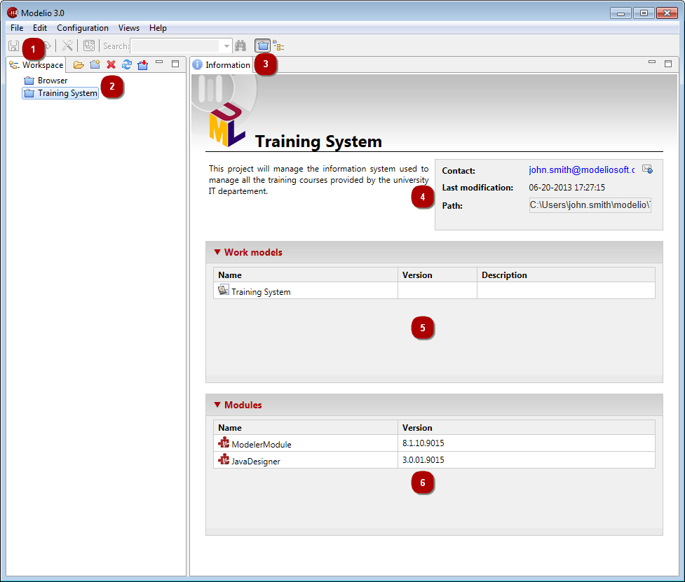

[[The-workspace-view]]

[[the-workspace-view]]
The workspace view
------------------

[[The-workspace-view-2]]

[[the-workspace-view-1]]
The workspace view

*Key:*

* *1.* The “Workspace” tab.
* *2.* The Modelio projects present in the workspace.
* *3.* Information on the selected project.
* *4.* Description and contact of the selected project, you can click on the [] icon to send an email to the project’s author.
* *5.* Work models present in the selected project.
* *6.* Modules present in the selected project.

[[Main-workspace-view-commands]]

[[main-workspace-view-commands]]
Main workspace view commands
++++++++++++++++++++++++++++

*From the File menu:*

* *Create a Project* [image:images/Modeler-_modeler_interface_workspace_view/newProject_16.png[3] – Create a project… / *Ctrl+N* key] : Creates a new project.
* *Save current Project* [image:images/Modeler-_modeler_interface_workspace_view/saveProject_16.png[4] – Save project / *Ctrl+S* key] : Saves the current project.
* *Close current Project* [ – Close project] : Closes the current project.
* *Import a Project* [ – Import project… / *I* key] : Imports a full project (*.zip) in the current workspace.
* *Switch workspace* [image:images/Modeler-_modeler_interface_workspace_view/workspace.png[6] – Switch workspace…] : Switches to another workspace.
* *Close Modelio* [ – Exit] : Closes and exits Modelio.

*From the contextual menu:*

* *Open a Project* [ – Open Project / double-click / *O* key] : Opens an existing project.
* *Close current Project* [ – Close project] : Closes the current project.
* *Delete a Project* [image:images/Modeler-_modeler_interface_workspace_view/delete.png[11] – Delete Project / *Del* key] : Deletes an existing project.
* *Export a Project* [ – Export project…/ *X* key] : Exports a full project into a zip archive.

*Note:* For more information, see “link:Modeler-_modeler_managing_projects_create_project.html[Creating a project]” and “link:Modeler-_modeler_managing_projects_configuring_project_informations.html[Configuring project information]”.

