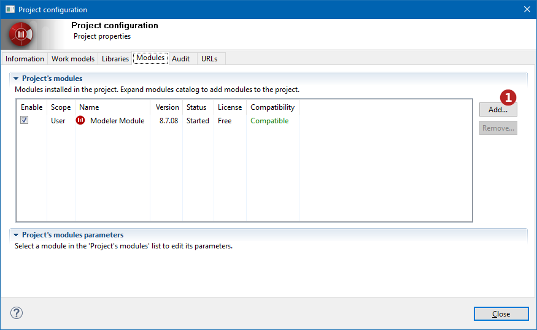
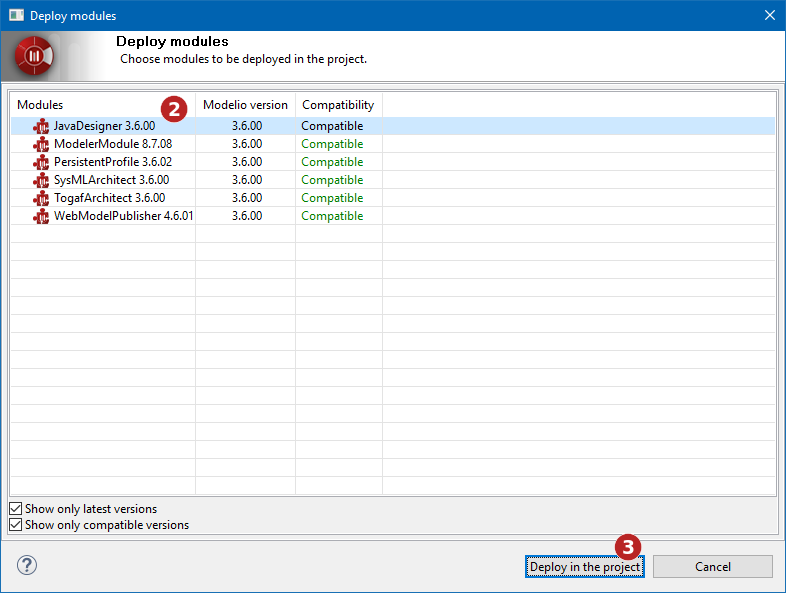
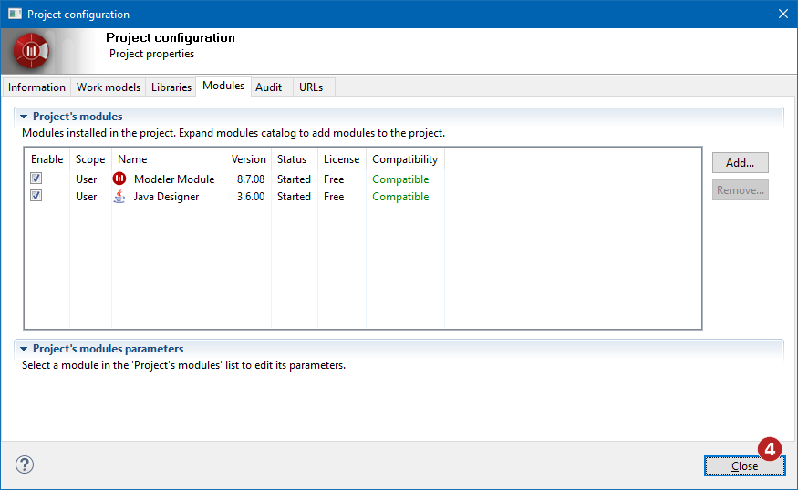
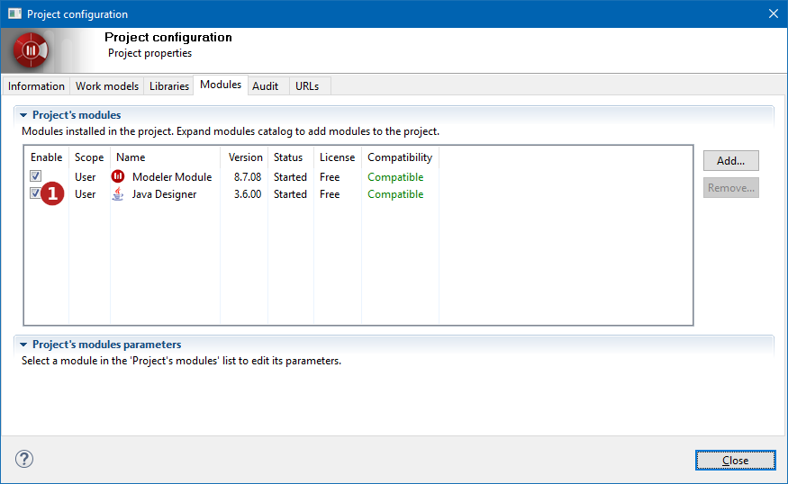
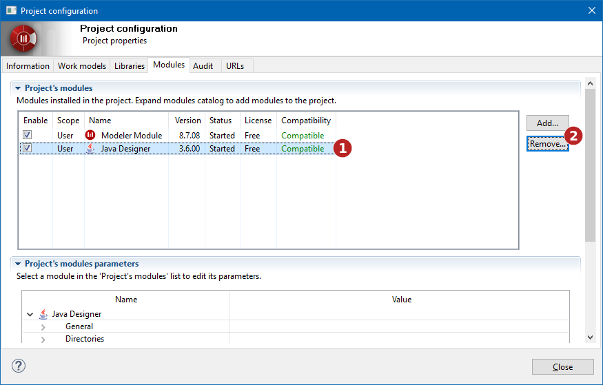
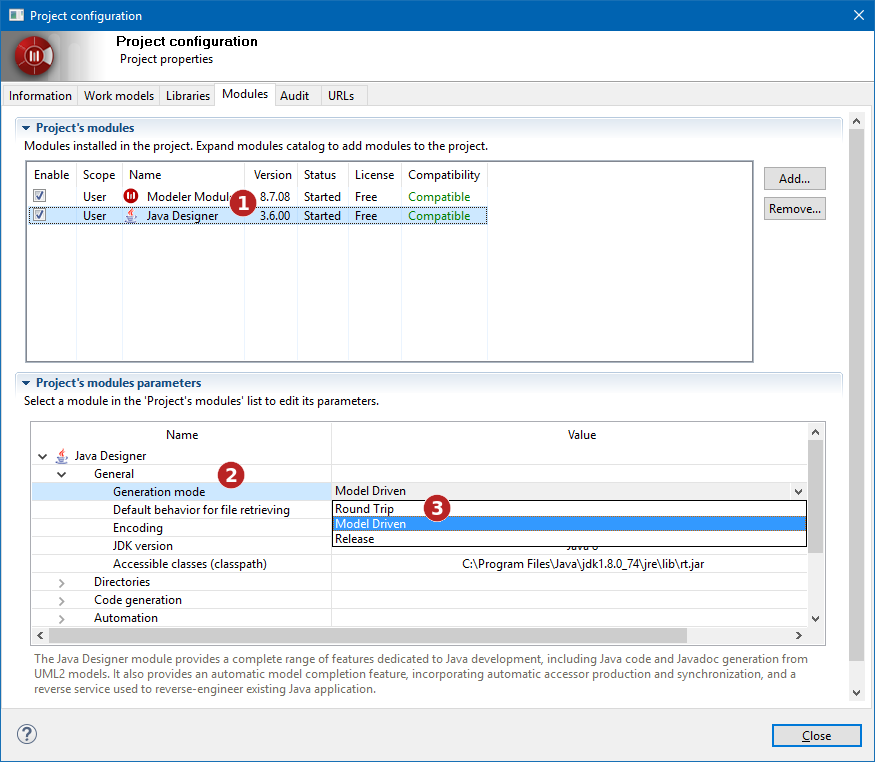

[[Configuring-project-modules]]

[[configuring-project-modules]]
Configuring project modules
---------------------------

[[What-are-Modelio-modules]]

[[what-are-modelio-modules]]
What are Modelio modules?
+++++++++++++++++++++++++

Modelio modules are complementary components, each of which provides specific services tailored to a particular modeling need.

Modelio provides a number of modules, all of which exploit a model for a specialized need (for example, documentation or Java code generation).

When a module is installed, it provides specific menus, icons and specialized annotations. Some modules also add their own property view, designed to make it even easier to enter module-specific elements, such as dedicated notes and tagged values.

*Note:* To open the “Modules” tab of the Project Configurator, just run the “ Modules…” command from the “Configuration” menu.

[[Installing-modules-in-a-project]]

[[installing-modules-in-a-project]]
Installing modules in a project
+++++++++++++++++++++++++++++++

[[Installing-a-module-in-a-project]]

[[installing-a-module-in-a-project]]
Installing a module in a project

*Steps:*

*1*. Click on the “Add” button to show the catalog’s modules +
*2*. In the ‘Deploy modules’ window, select the module you want to deploy in the project +
*3*. Click on the “Deploy in the project” button to validate your choice +
*4*. Click on the “Close” button to quit the ‘Project configuration’ window

[[ActivatingDeactivating-modules]]

[[activatingdeactivating-modules]]
Activating/Deactivating modules
+++++++++++++++++++++++++++++++

Modelio provides a module activation/deactivation feature that enables you to activate or deactivate any and all of the modules installed in your project at any time.

When you install a module in your project, it is automatically activated (active module tickboxes are checked).

When modules are deactivated, they remain available for subsequent activation in your project, meaning you can still see and use module-specific extensions. This can be useful for team members who do not actually need to work with a given module, but who still need to be able to see dedicated module annotations used by other team members, for example.

To activate or deactivate a module in your project, just check/uncheck the relevant tick box, as shown below.

[[ActivatingDeactivating-modules-in-your-project]]

[[activatingdeactivating-modules-in-your-project]]
Activating/Deactivating modules in your project

*Steps:*

*1*. Check/uncheck the tick box of the module you want to activate/deactivate

[[Removing-modules-from-a-project]]

[[removing-modules-from-a-project]]
Removing modules from a project
+++++++++++++++++++++++++++++++

Removing a module will delete all its annotations and disable all its commands and functionalities. This cannot be undone, meaning that even reinstallation of the module will not restore the annotations.

[[Removing-a-module-from-a-project]]

[[removing-a-module-from-a-project]]
Removing a module from a project

*Steps:*

*1*. Select the module you want to remove. *2*. Click on the “Remove…” button to remove the module from the project.

[[Setting-module-parameters]]

[[setting-module-parameters]]
Setting module parameters
+++++++++++++++++++++++++

Each module installed in your project provides a set of parameters used to define various specific options, typically generation directories, edition tools and default selections.

[[Setting-module-parameters-2]]

[[setting-module-parameters-1]]
Setting module parameters

*Steps:*

*1*. Select a module +
*2*. Expand a parameter category +
*3*. Set the desired parameter values

