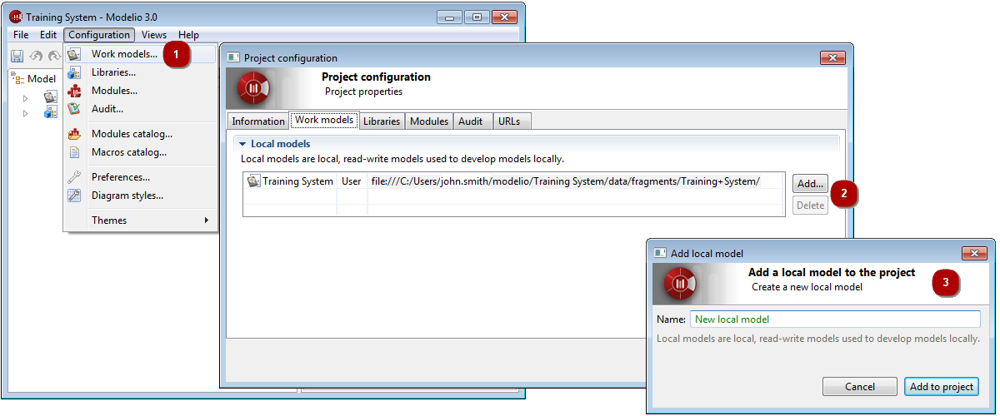

[[Configuring-project-work-models]]

[[configuring-project-work-models]]
Configuring project work models
-------------------------------

A *work model* in a Modelio 3 project is a modifiable model that is being worked on by the end-user.

Each newly created project is automatically configured to have at least one local work model which is typically the main model you will be working on.

You can define additional work models in your project, in order, for example, to experiment some work out of the main model, or to model tests without messing around with the main model.

Work models are managed in the *Work models* tab of the *Project configurator* dialog.

[[Configuring-project-work-models-2]]

[[configuring-project-work-models-1]]
Configuring project work models

1.  Click on “Configuration\Work models…” or on the [] icon then select “Work models” tab.
2.  You can add new locals models to your project, or remove existing ones.
3.  To add a new local model, click on the “Add…” button, then simply enter a name for it. Confirm by clicking on the “Add to project” button.

