[[Modelio-diagram-themes-and-element-styles]]

[[modelio-diagram-themes-and-element-styles]]
Modelio diagram themes and element styles
-----------------------------------------

The graphical appearance of diagram elements is defined in either a diagram theme, or an element style. +
A diagram theme is a set of graphic properties that are applied to a whole diagram and its elements. +
An element style is a set of graphic properties that can be applied to a single element, regardless of the diagram theme.

Modelio provides built-in themes for diagrams. The theme of a diagram is indicated in the Symbol view: image:images/Modeler-_modeler_modelio_settings_diagram_styles/themes_styles_001.png[image]

[[The-diagram-theme-selector]]

[[the-diagram-theme-selector]]
_The diagram theme selector_

*Steps* +
      1. Click in the diagram’s background +
      2. The diagram theme is indicated in the symbol view +
  +
  +
To change the graphical theme of a diagram, just click on the theme selector in the Symbol view, and choose a theme from the drop-down list: 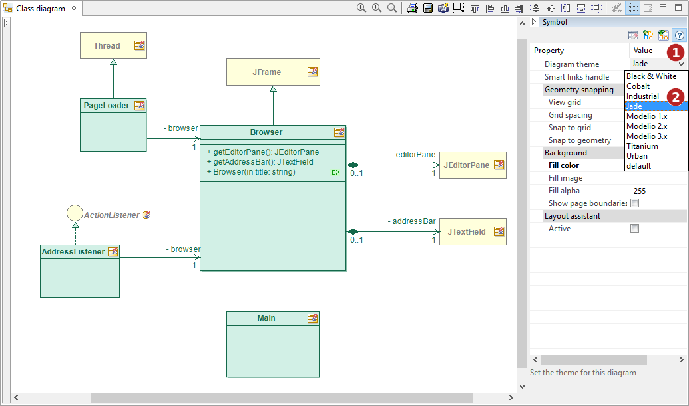

[[Choosing-a-diagram-theme]]

[[choosing-a-diagram-theme]]
_Choosing a diagram theme_

*Steps:* +
      1. Click on the theme selector +
      2. Choose a theme from the drop-down list +
      3. The theme is applied to the diagram +
  +
  +
Regardless of the diagram theme, an element can have its own style. +
By default, the style of a diagram element is “Defined by diagram”: 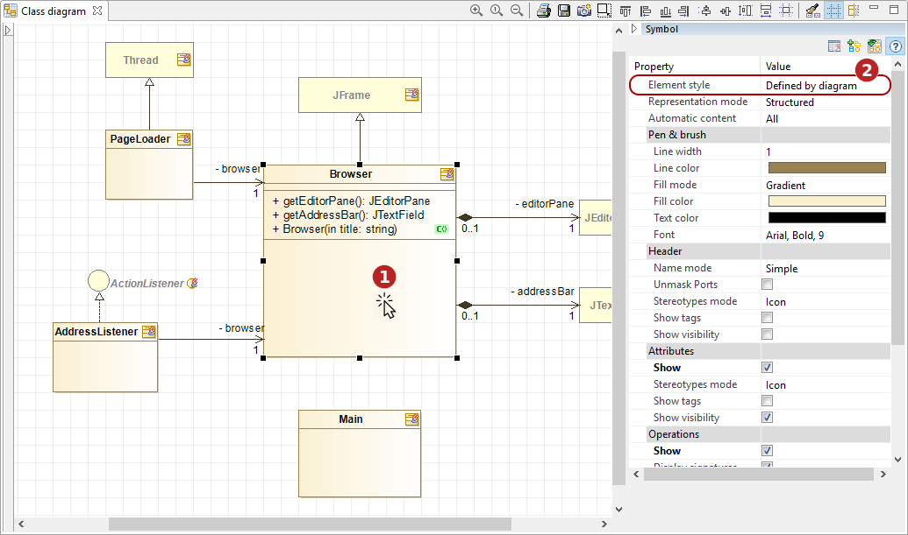

[[The-element-style-selector]]

[[the-element-style-selector]]
_The element style selector_

*Steps:* +
      1. Click in the diagram element +
      2. The element style is indicated in the symbol view +
  +
 

To change the graphical style of an element, just click on the style selector in the Symbol view, and choose a style from the drop-down list: 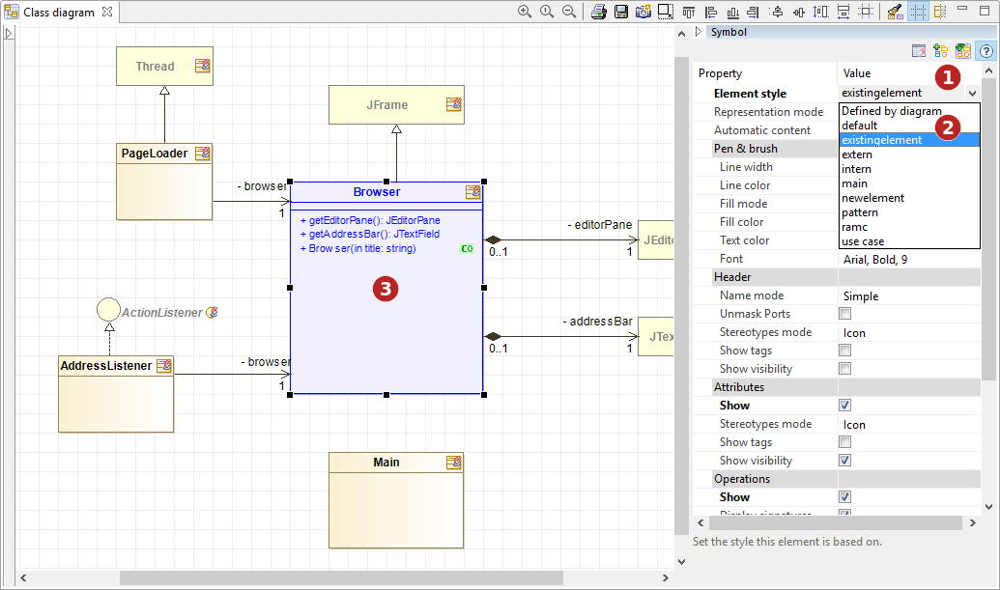

[[Choosing-an-element-style]]

[[choosing-an-element-style]]
_Choosing an element style_

*Steps:* +
      1. Click on the style selector +
      2. Choose a style from the drop-down list

      3. The style is applied to the selected element +
  +
 

[[Custom-diagram-themes]]

[[custom-diagram-themes]]
Custom diagram themes
+++++++++++++++++++++

Modelio also offers the possibility to create custom diagram themes so you can create your own. To do so, you have to open the diagram style/theme editor: +
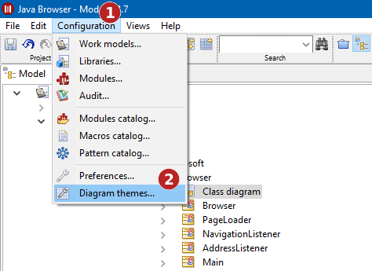

[[Opening-the-diagram-styletheme-editor]]

[[opening-the-diagram-styletheme-editor]]
_Opening the diagram style/theme editor_

*Steps:* +
      1. In the menu bar, click on ‘Configuration’ +
      2. In the drop-down menu, click on ‘Diagram themes…’ +
  +
 

In the diagram style/theme editor, create a new theme: +
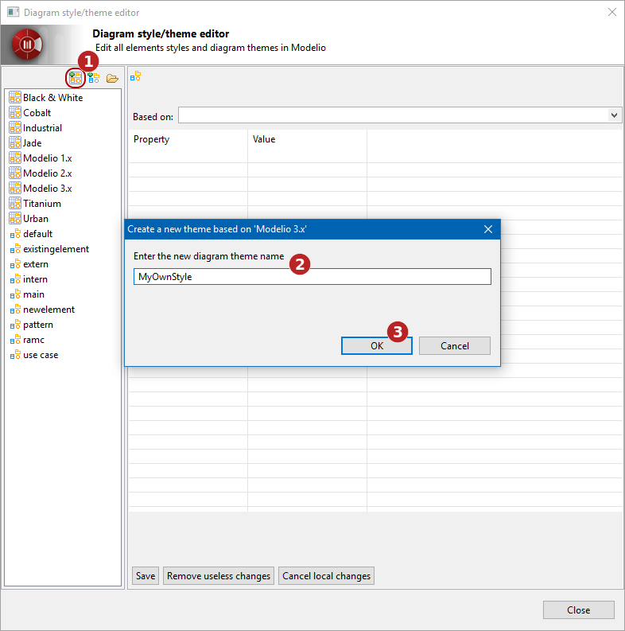

[[Creating-a-diagram-theme]]

[[creating-a-diagram-theme]]
_Creating a diagram theme_

*Steps:* +
      1. Click on the ‘Create a new diagram theme' button  +
      2. Name your diagram theme +
  +
 

Customize your new theme: +
image:images/Modeler-_modeler_modelio_settings_diagram_styles/themes_styles_007.png[image]

[[Customizing-a-diagram-theme]]

[[customizing-a-diagram-theme]]
_Customizing a diagram theme_

*Steps:* +
      1. Select your theme in the list +
      2. Choose properties to customize +
      3. Modify properties values +
      4. Save your theme +
      5. Close the diagram style/theme editor +
  +
 

Apply your new theme to a diagram: +
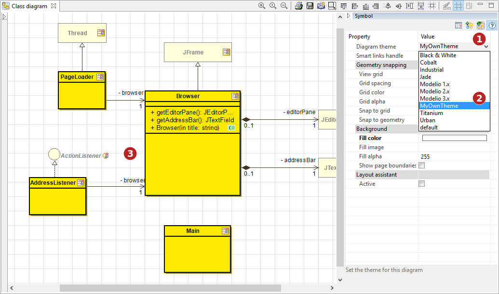

[[Applying-a-new-diagram-theme]]

[[applying-a-new-diagram-theme]]
_Applying a new diagram theme_

*Steps:* +
      1. Click on the theme selector +
      2. Choose your theme from the drop-down list +
      3. The theme is applied to the diagram +
  +
 

*Note*: the same process can be used to edit and customize a built-in theme.

[[Importing-an-external-theme]]

[[importing-an-external-theme]]
Importing an external theme
+++++++++++++++++++++++++++

External themes can be imported into Modelio. Then, they can be used as is, or customized in the diagram style/theme editor. +
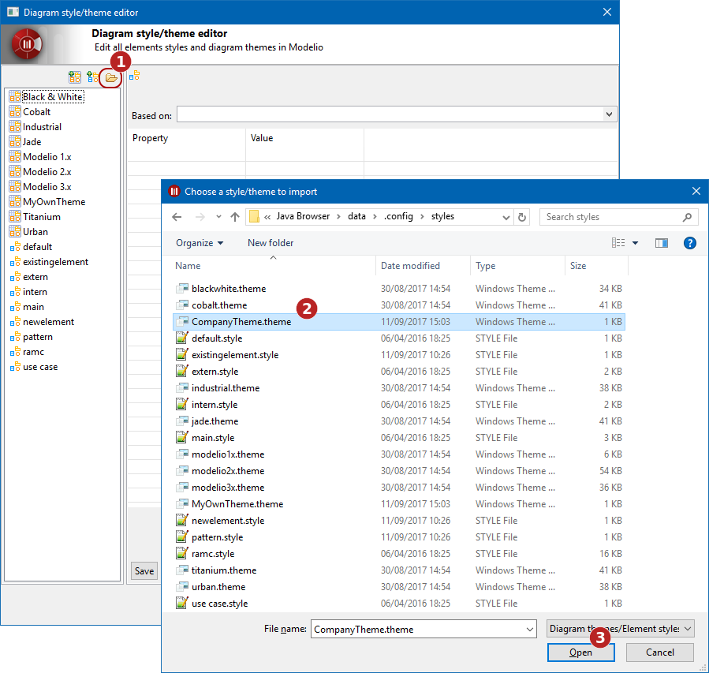

[[Applying-a-new-diagram-theme-2]]

[[applying-a-new-diagram-theme-1]]
_Applying a new diagram theme_

*Steps:* +
      1. In the diagram style/theme editor, click on the ‘Choose a style/theme to import’ button  +
      2. Browse your disk or network to the theme you want to import +
      3. Click on the ‘Open’ button +
  +
 

[[Element-style-creation]]

[[element-style-creation]]
Element style creation
++++++++++++++++++++++

There are two ways to create a new element style, the Diagram style/theme editor, and the Symbol view of a diagram.

*Creating an element style with the Diagram style/theme editor* +
To create a new element style with the Diagram style/theme editor, click on the ‘Create a new element style’ button , and name your new style. Then, you can customize it:

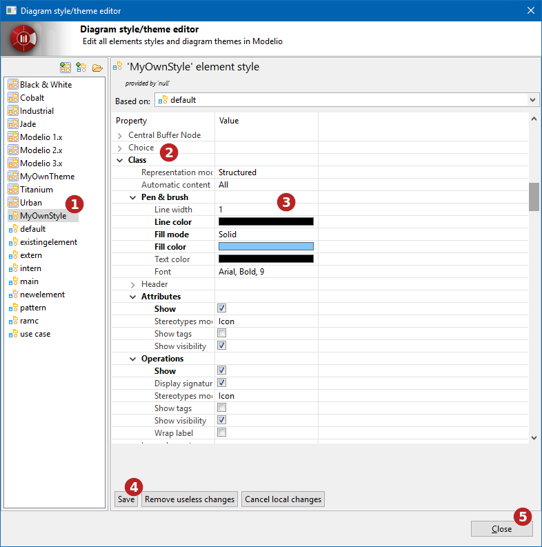

[[Customizing-a-diagram-style]]

[[customizing-a-diagram-style]]
_Customizing a diagram style_

*Steps:* +
      1. Select your style in the list +
      2. Choose properties to customize +
      3. Modify properties values +
      4. Save your style +
      5. Close the Diagram style/theme editor +
  +
 

Your new style is available in the Symbol view and can be applied to the relevant elements: +
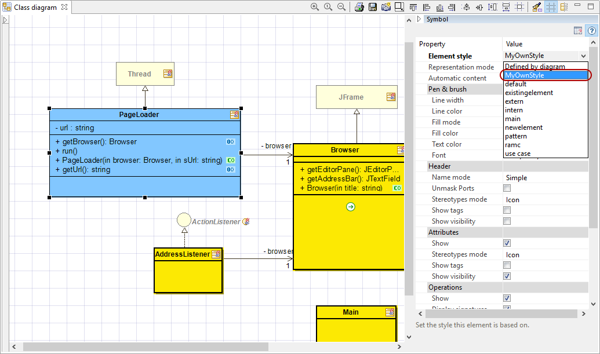

[[New-element-style-in-element-styles-selector]]

[[new-element-style-in-element-styles-selector]]
_New element style in element styles selector_

  +
 

*Creating an element style with the Symbol view*

When the graphic properties of an element are modified in the Symbol view, they can be saved as a new element style: +
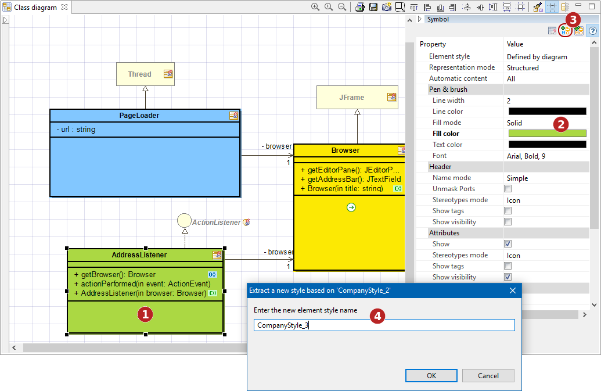

[[Creating-a-new-element-style-from-modified-graphic-properties]]

[[creating-a-new-element-style-from-modified-graphic-properties]]
_Creating a new element style from modified graphic properties_

*Steps:* +
      1. Select an element in a diagram +
      2. Modify the graphic properties in the Symbol view +
      3. Click on the ‘Create a new style’ button  +
      4. Name the new style +
  +
 

Your new style is available in the Symbol view and can be applied to the relevant elements: +
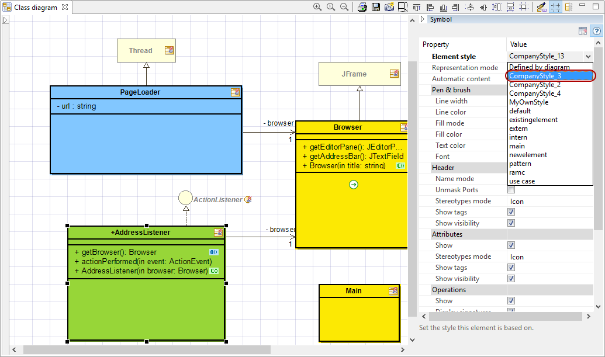

[[New-element-style-in-element-styles-selector-2]]

[[new-element-style-in-element-styles-selector-1]]
_New element style in element styles selector_

  +
 

Note: The current diagram theme can be updated from modifications made in the Symbol view. To do so, once you have made your changes in the Symbol view, click on the ‘Update theme’ button: +
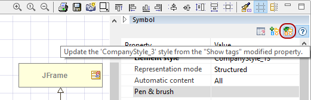

[[Updating-an-existing-style-from-the-Symbol-view]]

[[updating-an-existing-style-from-the-symbol-view]]
_Updating an existing style from the Symbol view_

  +
 

