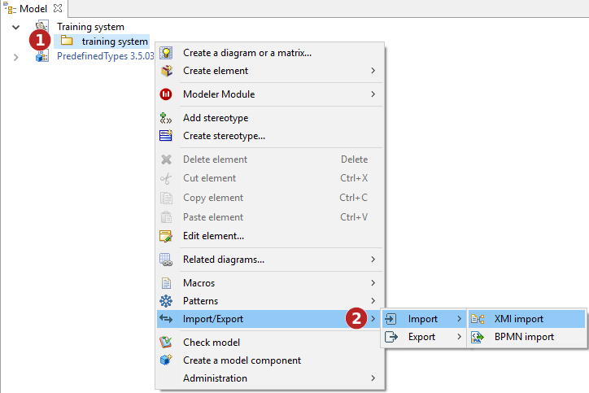
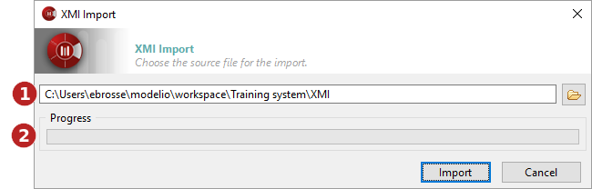

[[Importing-a-model-in-XMI-format]]

[[importing-a-model-in-xmi-format]]
Importing a model in XMI format
-------------------------------

[[Introduction]]

[[introduction]]
Introduction
++++++++++++

The Modelio XMI import operation is used to import a UML2 model into Modelio from an XMI file.

The “XMI Import” command can only be run on packages. Imported elements will be located in the selected package.

[[The-XMI-Import-command]]

[[the-xmi-import-command]]
The XMI Import command

Key:

. Right-click on a package to open the context menu.

. Run the “Import/Export \ Import \ XMI Import” command.

[[The-ldquoXMI-Importrdquo-window]]

[[the-xmi-import-window]]
The “XMI Import” window
+++++++++++++++++++++++

[[The-XMI-import-window]]

[[the-xmi-import-window-1]]
The XMI import window

Key:

. This field is where you select the path of the XMI file that you are about to import.

. This progress bar shows the progress of the import operation.

